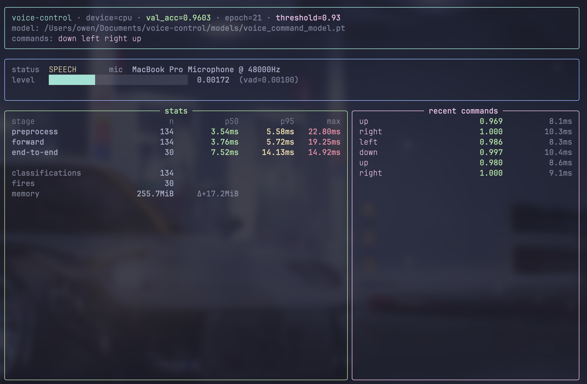

# Voice Control

Voice Control is a hands-free keyboard. It listens to your microphone in real time, and when you say "up", "down", "left", or "right", it presses the matching arrow key on your computer. You can use it to control games, scroll pages, navigate menus, or anything else that reacts to arrow keys — without touching the keyboard.

Under the hood it runs a small convolutional neural network trained on Google Speech Commands v2. Audio is captured from the mic, chopped into short sliding windows, and classified locally on your machine. Nothing is sent to the cloud. A simple GUI lets you pick your microphone, tune the confidence threshold, and rebind commands to different keys.

## Requirements

- Python 3.12
- A working microphone

## Install

```bash
uv sync
```

`uv` will create and manage `.venv` for you, install the project package, and
lock dependencies in `uv.lock`.

Useful commands:

```bash
uv add <package>
uv remove <package>
uv lock
uv sync
```

The trained model is already in `models/`, so you can run it straight away.

- **macOS**: you'll be asked to grant microphone and accessibility permissions the first time.
- **Windows**: supported for the CLI and GUI.
- **Linux**: use the CLI instead of the GUI. Install system packages first; on Arch: `sudo pacman -S python tk portaudio`. Keyboard injection depends on an X11/Xwayland session, so if `DISPLAY` is unset or you are on pure Wayland, `pynput` may fail to start.

## Run

```bash
uv run python -m voice_control.runtime.inference   # CLI
uv run python -m voice_control.runtime.ui          # GUI
```

Short aliases:

```bash
uv run voice-control
uv run voice-control-ui
```

The CLI launches a live dashboard with mic level, per-stage latencies,
memory, and the last few commands — press Ctrl+C to stop and see the
session summary.



To retrain from scratch: `uv run python scripts/download_model.py`.
